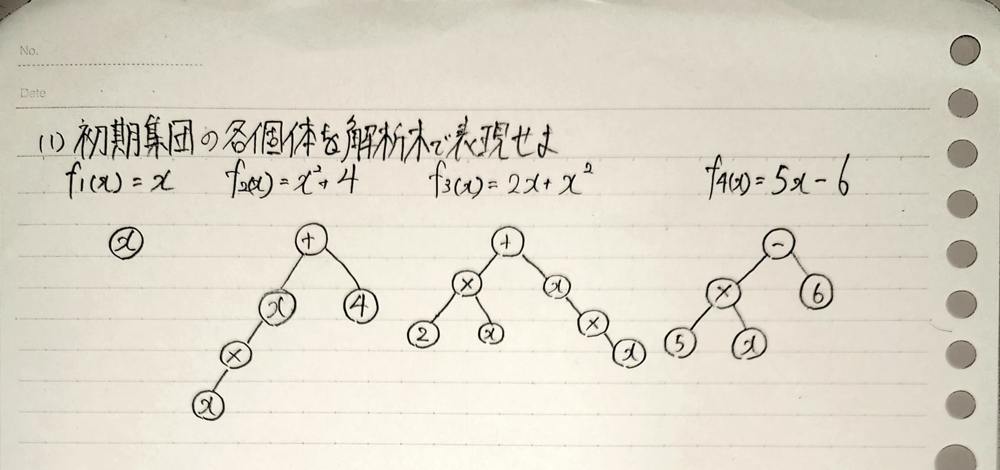

# 第6回課題 T322022 加藤 達也
## 【1】入力関係が不明な写像f(x)の最大値をGAを用いて求めることを考える。遺伝子長を6,各遺伝子座の対立遺伝子を{0,1},表現型xを遺伝子型の2進数表現、適合度をf(x)とする。不明な写像がf(x)=-x+70であったとき、次の4個体を初期集団として以下の問に答えよ。

### (1)初期集団の各個体の適合度を求めよ。
A[011011]の適合度は f(27)=-27+70=43 で43である。\
B[101100]の適合度は f(44)=-44+70=36 で36である。\
C[110101]の適合度は f(53)=-53+70=17 で17である。\
D[111000]の適合度は f(56)=-56+70=14 で14である。

### (2)ルーレット方式を使用した時の初期集団の各個体の選択確立を求めよ。
A[011011]の選択確立は 43/(43+36+17+14)≒0.39 \
B[101100]の選択確立は 36/(43+36+17+14)≒0.33 \
C[110101]の選択確立は 17/(43+36+17+14)≒0.15 \
D[111000]の選択確立は 14/(43+36+17+14)≒0.13

### (3)個体C,Dが親個体として選択され、遺伝子の型の中央部分で一点交叉をしたときの得られる子個体を答えよ。
親:C[110|101] ⇒ 子:1[110|101] \
親:D[111|000] ⇒ 子:2[111|110]

### (4)不明な写像が$f(x)=-x^{2}+80x-600$であったとき、f(x)の適合度として用いることができない。その理由を答えよ。また、適切な適合度の関数の例を考えよ。
xが8以下の時、f(x)が負になるので、適合度として用いることができない。適切な適合度は

## 【2】
### (1)

